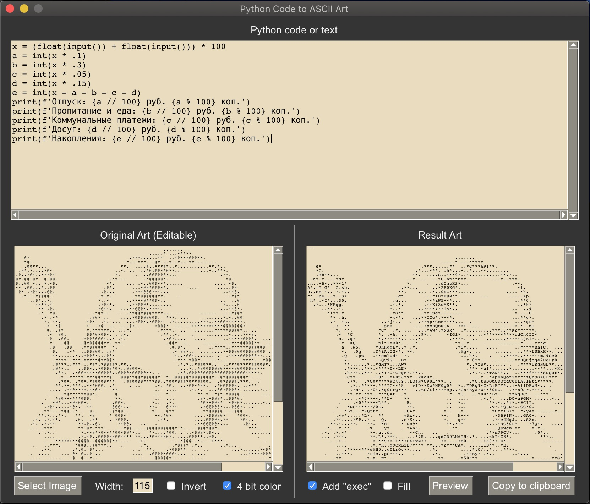
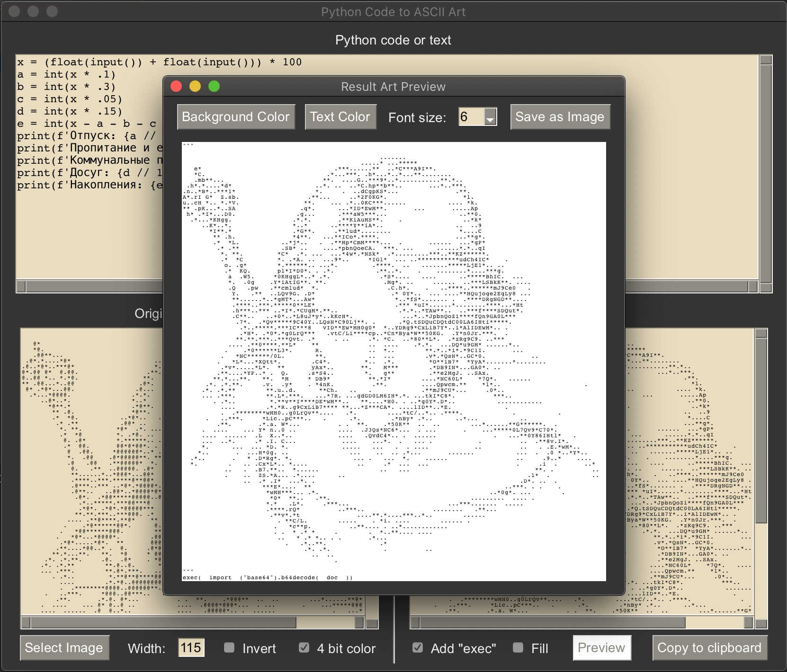
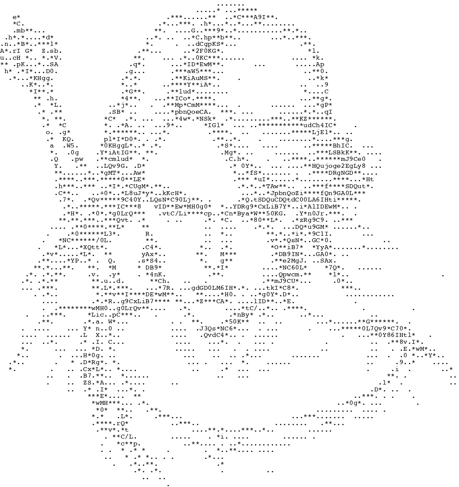

# Pycode ASCII Art
Создает ASCII картинку из Python кода на основе изображения.
Позволяет сделать полученную ASCII картинку исполняемым Python кодом, 
который будет выполнять то же, что и исходный код.

### Интерфейс программы и пример её работы:

#### Исходное изображение и результат:

Результат в виде python кода: 
[ciri-art.py](ciri-art.py)
(при запуске ожидает ввода 2х чисел)

---

## Зависимости и используемые библиотеки:
- PySimpleGUI
- clipboard
- Pillow

---

## Для работы с программой

- скачать или клонировать репозиторий
- запускать main.py (<code>python main.py</code> или <code>python3 main.py</code>)

## Примечания

- программа создана исключительно в развлекательных целях
- !!! НИКОГДА не запускайте чужой код оформленный в таком виде, предварительно не убедившись в его безопасности
